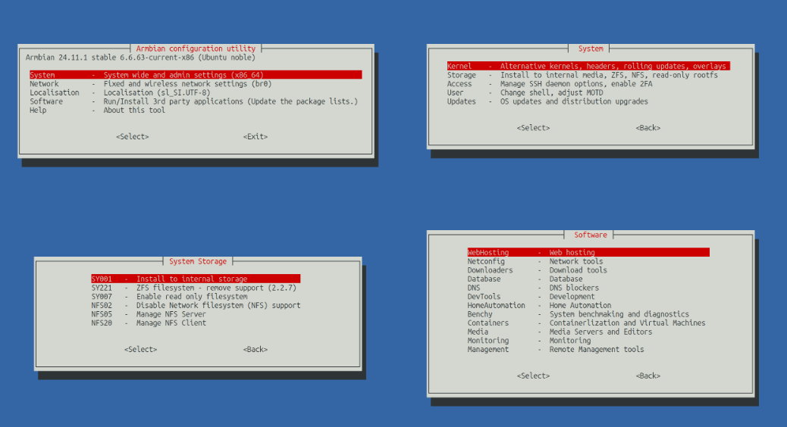

<h2 align="center">
  <a href="#"></a>
  <br><br>
</h2>

# Armbian Config (configng)

Source code for **Armbian Config** — a lightweight, modular configuration utility for Armbian and other Debian/Ubuntu-based Linux systems. It provides interactive (whiptail) and scriptable routines for setting up SBCs: kernel and boot management, networking, storage, desktop environments, and a curated catalogue of self‑hosted software.

## Quick start

Armbian Config ships **preinstalled** with Armbian images. To launch it:

```bash
sudo armbian-config
```

<a href="#"></a>

## Compatibility

Optimised for [**Armbian Linux**](https://www.armbian.com), but generally works on any systemd-based, APT-compatible distribution (Debian, Ubuntu, Linux Mint, Kali, MX, Proxmox, Raspberry Pi OS, …).

<details><summary>Add the Armbian key + repository and install the package:</summary>

```bash
wget -qO - https://apt.armbian.com/armbian.key | gpg --dearmor | \
  sudo tee /usr/share/keyrings/armbian.gpg > /dev/null
cat << EOF | sudo tee /etc/apt/sources.list.d/armbian-config.sources > /dev/null
Types: deb
URIs: https://github.armbian.com/configng
Suites: stable
Components: main
Signed-By: /usr/share/keyrings/armbian.gpg
EOF
sudo apt update
sudo apt -y install armbian-config
armbian-config
```
</details>

## What it can do

The full, generated feature index lives in [`DOCUMENTATION.md`](DOCUMENTATION.md). At a glance:

- **System** — alternative kernels, headers, device tree overlays, bootenv; install to internal media (eMMC/NVMe/SATA/USB/UFS or Windows dual‑boot), ZFS, NFS, read‑only rootfs; SSH daemon options and 2FA; shell selection and MOTD; OS updates, distribution upgrades, rolling vs. stable repositories.
- **Desktop** — install / uninstall / retier XFCE, GNOME, KDE Plasma, KDE Neon, MATE, Cinnamon, i3, Budgie, Deepin, Enlightenment, Xmonad, Bianbu; autologin toggles; Armbian branding, greeters (LightDM slick‑greeter, SDDM plasma‑chili) and skel defaults.
- **Network** — basic setup, fallback DHCP removal, bridged interface configuration.
- **Localisation** — timezone, locales, keyboard, hostname.
- **Software** — one‑shot install/remove/purge for a large catalogue: Docker, Portainer, AdGuard Home, Pi‑hole, Unbound, MySQL/MariaDB/PostgreSQL/Redis, Nextcloud/ownCloud, Jellyfin/Emby/Plex‑adjacent tools, *arr suite (Sonarr, Radarr, Lidarr, Prowlarr, Bazarr, Medusa, Jellyseerr), Home Assistant, OpenHAB, Domoticz, Grafana, Prometheus, Netdata, Uptime Kuma, NetAlertX, NetBox, Cockpit, Samba, OpenMediaVault, Syncthing, Duplicati, Immich, Ghost, Filebrowser, EVCC, OctoPrint, Actual Budget, Stirling PDF, and more.
- **Armbian infrastructure** — self‑hosted CDN/mirror router, GitHub Actions runners (`module_armbian_runners`), rsyncd.

## Repository layout

```
bin/armbian-config              # main entrypoint (assembled)
debian.conf                     # Debian packaging metadata
share/
  applications/configng.desktop # .desktop launcher
  icons/hicolor/…               # app icons (PNG + SVG)
tools/
  config-assemble.sh            # Bash: assemble modules + jobs into bin/armbian-config
  config-markdown.py            # Python: generate Markdown docs from JSON
  json/                         # source JSON: help, localisation, network, software, system, temp
  modules/                      # feature modules (Bash), grouped by area
    desktops/                   # DE postinst scripts, YAML matrix, branding, greeters, skel
  include/
    markdown/                   # per-ID header/footer Markdown snippets
    images/                     # per-ID screenshots (PNG/WebP)
tests/
  *.conf                        # unit-test cases per module (see tests/README.md)
  bats/                         # Bats tests + JSON fixtures for detect/plan/transfer/dualboot
.github/workflows/              # CI (YAML)
DOCUMENTATION.md                # generated feature index
```

## Build & assemble

The runnable `bin/armbian-config` is assembled from the modules under `tools/modules/` and the JSON under `tools/json/` via `tools/config-assemble.sh`:

```bash
./tools/config-assemble.sh -h     # show options
./tools/config-assemble.sh -p     # assemble for production
./tools/config-assemble.sh -t     # assemble for testing
bin/armbian-config                # run
```

Documentation is regenerated by the assembled binary and the Python helper:

```bash
bin/armbian-config --doc                       # regenerate DOCUMENTATION.md
python3 tools/config-markdown.py -u            # user docs
python3 tools/config-markdown.py -t            # technical docs
```

Per‑ID header/footer snippets in `tools/include/markdown/` and images in `tools/include/images/` are embedded automatically into the generated Markdown.

### Debian packaging

The Debian package is built via the shared workflow `armbian/scripts/.github/workflows/pack-debian.yml` (see `.github/workflows/maintenance-build-debian.yml`). Runtime dependencies declared there include:

`bash, jq, whiptail, sudo, procps, systemd, lsb-release, iproute2, debconf, libtext-iconv-perl, gpg, xz-utils, pv, python3-yaml, expect-dev, rsync, parted, dosfstools, e2fsprogs, btrfs-progs, f2fs-tools, ntfs-3g`

## Testing

Two complementary test suites live under `tests/`:

- **Module unit tests** — one `.conf` per module (e.g. `tests/docker.conf`, `tests/nextcloud.conf`). Each defines `ENABLED`, an optional `RELEASE` filter (`bookworm:jammy:noble`), and a `testcase()` function that must return 0 on success. See [`tests/README.md`](tests/README.md) for the full convention.

  ```sh
  ENABLED=true
  RELEASE="bookworm:noble"
  testcase() {
      ./bin/armbian-config --api module_cockpit install
      [ -f /usr/bin/cockpit-bridge ]
  }
  ```

- **Bats tests** — under `tests/bats/`, covering the boot / detect / plan / transfer / dualboot logic with JSON `lsblk` fixtures. Executed by CI via:

  ```bash
  bats tests/bats/plan.bats tests/bats/detect.bats tests/bats/detect_windows.bats \
       tests/bats/bootconfig.bats tests/bats/dualboot.bats tests/bats/transfer.bats
  sudo bats tests/bats/integration_loopback.bats tests/bats/integration_dualboot.bats
  ```

## Continuous integration

GitHub Actions workflows in `.github/workflows/`:

| Workflow | Purpose |
|---|---|
| `data-validate-json.yml` | Validate `tools/json/*.json`: empty `author` fields, ID length (6 chars, with exclusions), duplicate IDs, duplicate `module_options` ports. |
| `maintenance-bats.yml` | Run the Bats unit + integration tests. |
| `maintenance-build-debian.yml` | Assemble (`config-assemble.sh -p`) and build the Debian package via `armbian/scripts`; dispatch unit tests. |
| `maintenance-build-docs.yml` | Rebuild `DOCUMENTATION.md` and the joined JSON, open an auto PR. |
| `maintenance-check-coding-style.yml` | `editorconfig-checker` against `.editorconfig`. |
| `maintenance-lint.yml` | ShellCheck (severity=error) on changed Bash files. |
| `maintenance-desktop-audit.yml` | Weekly desktop-matrix audit against `armbian/build` + Debian/Ubuntu package archives; hands actionable findings to Claude Code and opens a PR. |
| `maintenance-unit-tests.yml` | Runs the module `.conf` unit tests. |
| `maintenance-pr-auto-label.yml`, `maintenance-pr-label-on-approval.yml`, `maintenance-pr-listen-review.yml`, `maintenance-sync-labels.yml` | PR / issue labelling automation driven by `.github/labels.yml` and `.github/labeler.yml`. |
| `maintenance-community-welcome-issue.yml` | Greets first-time issue authors. |
| `maintenance-stale.yml` | Closes issues idle after the `Can be closed?` label. |
| `maintenance-clean-workflow-logs.yml` | Weekly pruning of old workflow runs. |
| `maintenance-watchdog.yml` | Repo watchdog job. |

## Built with

- **Bash** — the CLI (`bin/armbian-config`), the assembler (`tools/config-assemble.sh`), the module scripts under `tools/modules/`, and DE postinst scripts.
- **Python 3** — `tools/config-markdown.py` (stdlib: `json`, `sys`, `argparse`, `os`), plus desktop audit helpers under `tools/modules/desktops/github/` and `tools/modules/desktops/scripts/parse_desktop_yaml.py` (uses `pyyaml`).
- **YAML** — GitHub Actions workflows, labeler configuration, desktop matrix under `tools/modules/desktops/yaml/`.
- **JSON** — the configuration data model in `tools/json/` and Bats fixtures.
- **QML / Qt** — the bundled SDDM `plasma-chili` greeter theme.
- **Bats** + `jq`, `parted`, `dosfstools`, `ntfs-3g` — test harness.
- **whiptail** — TUI frontend at runtime.

## Contributing

See [`CONTRIBUTING.md`](CONTRIBUTING.md) and the upstream guide:

<https://docs.armbian.com/Contribute/Armbian-config>

Please respect the [Code of Conduct](CODE_OF_CONDUCT.md). Labels used on issues and PRs are defined in [`.github/labels.yml`](.github/labels.yml) and applied automatically; details are in `CONTRIBUTING.md`.

Development loop:

```bash
tools/config-assemble.sh -t   # assemble a test build
bin/armbian-config            # try it
```

## Support

- **Community Forums** — <https://forum.armbian.com>
- **Chat (Discord / IRC / Matrix)** — <https://docs.armbian.com/Community_IRC/>
- **Commercial / consulting** — <https://www.armbian.com/contact>

## Contributors

Thanks to everyone who has contributed!

<a href="https://github.com/armbian/configng/graphs/contributors">
  
</a>

## Armbian Partners

Armbian's [partnership program](https://forum.armbian.com/subscriptions) helps support Armbian and its community. Please take a moment to visit [our Partners](https://armbian.com/partners).

## License

Released under the **GNU General Public License v3.0** — see [`LICENSE`](LICENSE).
